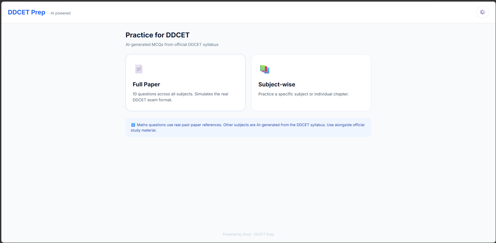
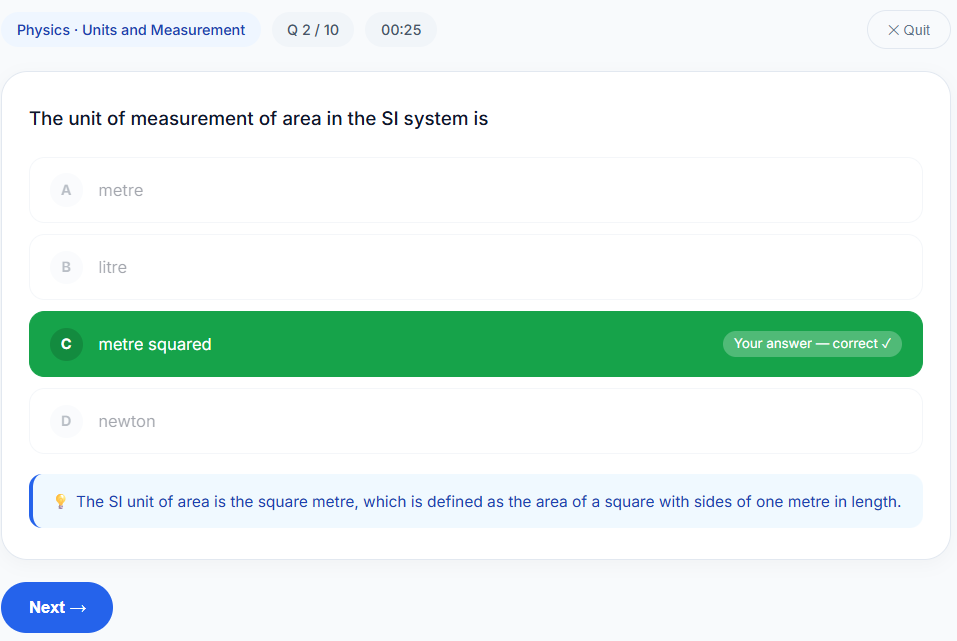
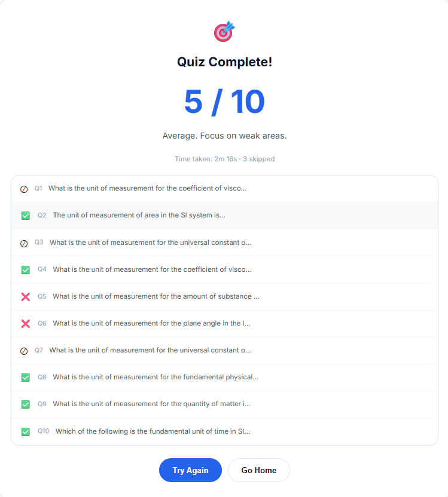

# 🎯 DDCET Prep


**DDCET Prep** is an AI-powered MCQ practice web app built for students preparing for the **DDCET (Diploma to Degree Common Entrance Test)**, Gujarat. It combines a hand-verified bank of **real past-paper Maths questions** with **AI-generated MCQs** (via the Groq LLM API) for Physics, Chemistry, English, Computer, and Environmental Studies — all inside a single, dependency-light HTML file.

---

# 📑 Table of Contents

- Features
- Screenshots
- Live Demo
- Technologies
- Project Structure
- How It Works
- Subjects Covered
- Installation
- Future Improvements
- Contributing
- License
- Author

---

# ✨ Features

✅ Full Paper Mode — 10 random questions across all subjects, simulating the real exam

✅ Subject-wise / Chapter-wise Practice

✅ Real Past-Paper Questions for Maths (with step-by-step explanations)

✅ AI-Generated MCQs for Physics, Chemistry, English, Computer & Environment

✅ AI-Generated Comprehension Passages for English

✅ Auto-formatted Chemistry Equations (proper subscripts: H₂O, CO₂, etc.)

✅ Live Timer + Score Breakdown with Explanations

✅ Bring-Your-Own API Key (Groq) — stored only in your browser

✅ Zero Backend — fully client-side, no server needed

✅ Clean, Responsive, Mobile-Friendly UI

---

# 📸 Screenshots

<p align="center">

</p>

<p align="center">

</p>

<p align="center">

</p>

---

# 🚀 Live Demo

dhruvpandit46.github.io/DDCET/

---

# ⚙ Technologies Used

- HTML5
- CSS3
- JavaScript (Vanilla, ES6)
- Groq API (`llama-3.3-70b-versatile`)
- Google Fonts (Inter)

---

# 📂 Project Structure

```
DDCET/
│
├── index.html      → Entire app (UI + logic + question bank)
├── images/          → Screenshots
└── README.md
```

---

# ⚡ How It Works

1. Choose **Full Paper** (10 mixed questions) or **Subject-wise** practice.
2. For **Maths**, the app pulls verified questions from a built-in past-paper bank — no API needed, no repeats until the bank is exhausted.
3. For every other subject, the app sends a prompt to the **Groq API** using your saved key and generates a fresh MCQ with explanation in real time.
4. Answer, get instant feedback (correct/incorrect highlighting + explanation), and move to the next question.
5. At the end, see your score, time taken, and a full question-by-question breakdown.

Your Groq API key is saved **only in your browser's localStorage** — it's never sent anywhere except directly to Groq.

---

# 📚 Subjects Covered

| Subject | Source |
|---|---|
| Maths | Verified past-paper question bank |
| Physics | AI-generated (Groq) |
| Chemistry | AI-generated (Groq) with proper formula formatting |
| English | AI-generated MCQs + AI-generated comprehension passages |
| Computer | AI-generated (Groq) |
| Environment | AI-generated (Groq) |

Topics span the full official DDCET syllabus — Matrices, Trigonometry, Vectors, Coordinate Geometry, Calculus, Mechanics, Electric Current, Chemical Reactions, Grammar, Programming Concepts, Ecosystems, and more.

---

# 📦 Installation

Clone the repository

```bash
git clone https://github.com/dhruvpandit46/DDCET.git
```

Go inside the project

```bash
cd DDCET
```

Run

Simply open `index.html` in your browser, click the ⚙️ icon, paste your free [Groq API key](https://console.groq.com), and start practicing.

No installation, no build step required.

---

# 🎯 Future Improvements

- Expand past-paper banks for all subjects
- Add previous year full papers
- Progress tracking & analytics dashboard
- Bookmark/flag questions for revision
- Dark mode
- PWA / offline support
- Leaderboard system

---

# 🤝 Contributing

Contributions are welcome.

1. Fork the repository
2. Create your feature branch
3. Commit your changes
4. Push your branch
5. Open a Pull Request

---

# 📜 License

Licensed under the **MIT License**.

MIT © 2025 Dhruv Pandit.

See the [LICENSE](LICENSE) file for full license details.

---

# 👨‍💻 Author

**Dhruv Pandit**

GitHub — https://github.com/dhruvpandit46

LinkedIn — https://linkedin.com/in/dhruv-pandit-755786326

Instagram — https://instagram.com/dhruv_pandit20

---

# ⭐ Support

If you found this project useful, please consider giving it a ⭐ on GitHub.
It helps support future development.
